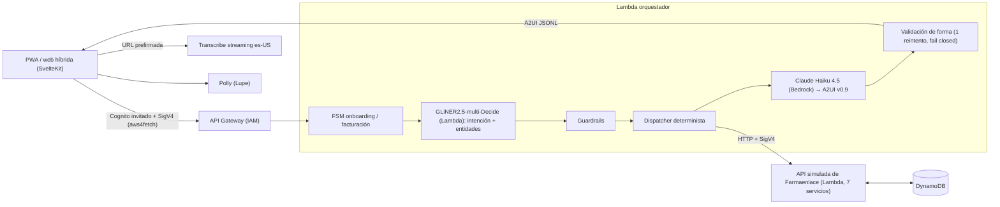

# Farmacéutico Virtual

**Tu farmacéutico más cercano, en el celular.**

Hackathon Connect atVentures 2026 (BuenTrip + Endeavor), reto Farmaenlace «Fidelización transversal».

- Hablas o escribes → la app arma la pantalla justa con UI generativa A2UI.
- Onboarding: cédula + consentimiento LOPDP (sin formularios).
- Flujo: productos OTC → SmartClub → farmacia → reserva → factura simulada.

## Demo en vivo

- **PWA** (IA real: Bedrock + GLiNER, datos sintéticos): https://main.d2bloxc35rzfqy.amplifyapp.com
- **PWA modo simulado** (sin backend): https://main.d2bloxc35rzfqy.amplifyapp.com/?demo
- **Web híbrida** (visión omnicanal; mismo backend y renderer A2UI, `?demo` simulado): https://main.dfsvbpju4hwi2.amplifyapp.com

Guion (Cuidador, cédula sintética `1710034065`): aceptar → reposición + «¿Por qué me sugieres esto?» → «algo para la gripe» → pregunta de seguridad → agregar → retirar aquí → resumen con cupón → consumidor final + email → reserva con QR + factura SIMULADA. Reiniciar → «dolor de pecho» → alerta roja. Contraste: Práctico `1712456787`.

## Presentación

- **Deck impress.js**: https://main.d3mdmicmjnjme4.amplifyapp.com
- **PDF de respaldo**: https://main.d3mdmicmjnjme4.amplifyapp.com/FarmaceuticoVirtual-pitch.pdf

## Qué es real vs simulado

| Real | Simulado |
|---|---|
| Claude Haiku 4.5 (Bedrock); GLiNER2.5-multi-Decide (Lambda) | Catálogo, stock, precios; SmartClub; farmacias; cupones |
| Transcribe streaming `es-US` + Polly (Lupe) | Identidad; CRM / insights |
| Validación módulo 10; admin read-only | Pedidos / factura **SIMULADA**; hand-off |
| Llamadas HTTP + SigV4 servidor a servidor, como en producción | API simulada de Farmaenlace (7 servicios, DynamoDB); farmacias con nombres/direcciones públicas de Quito |

AWS es la única API externa. API simulada de Farmaenlace: [`services/farmaenlace-mock/README.md`](services/farmaenlace-mock/README.md).

Audit log de conversación en DynamoDB `connect-atv-data` (query en [`services/api/CONTRACT.md`](services/api/CONTRACT.md)).

## Arquitectura



Renderer A2UI Svelte propio. Acciones comerciales solo tras guardrails + confirmación explícita. Bedrock ≤ 1 RPS.

## Guardrails (capa propia, no solo el prompt)

- Alarma → `AlertaRoja` fija (ECU 911, sin productos); se mantiene en turnos siguientes.
- Sin diagnóstico. Solo OTC; receta → farmacéutico.
- Pregunta de seguridad (alergias / medicamentos) antes del primer producto.
- Nunca verbaliza condiciones del CRM; personaliza solo por comportamiento.
- Consentimiento LOPDP. Aviso: «No reemplaza la consulta…».
- Ninguna acción comercial sin confirmación. A2UI inválido → 1 reintento y fail closed.

## Evidencia de calidad

- 46 tests offline (22 API + 7 admin + 10 voz + 7 puntuador LLM).
- Smoke e2e API desplegada 12/12; Playwright 17/17 (demo + live, 390×844; falla ante errores de consola).
- Suite LLM (`tests/llm`; `tests/llm/results/BENCHMARK.md`, `docs/MODEL-BENCHMARKS.md`).
- Revisiones: `docs/REVIEW-cursor.md`, `docs/REVIEW-opencode.md`.

## Cómo correr las pruebas

```bash
python3 -m unittest services/api/tests/test_api.py tests/e2e/test_admin_unit.py tests/e2e/test_voice_unit.py tests/llm/test_checks.py
python3 tests/e2e/smoke.py   # Lambda desplegada; opciones: --local handler | --cli | --only …
cd tests/playwright && npm install && npx playwright install chromium && npm run test:demo   # y test:live
FV_LLM_MODEL=haiku-4.5 FV_LLM_TEMPERATURE=0 python3 -m unittest tests/llm/test_consistency.py -v  # Bedrock
cd tests/playwright && npm run record   # video de respaldo (?demo); REAL=1 → API real
```

## Mapa del repo

| Ruta | Contenido |
|---|---|
| `app/` | PWA SvelteKit + renderer A2UI |
| `web/` | Web híbrida |
| `services/api/` | Orquestador Lambda + mocks (`CONTRACT.md`) |
| `services/dashboard/` · `infra/` | Dashboard; despliegue AWS |
| `tests/{llm,e2e,playwright}` · `docs/` | Suites; revisiones / benchmarks |
| `SPEC.md` · `PLAN.md` · `PITCH.md` · `DESIGN.md` · `AGENTS.md` · `TOOLING.md` | Spec / plan / pitch / diseño / agentes / tooling |

## Backlog / fuera de alcance

Ver [SPEC.md §17](SPEC.md): pago en app, entrega a domicilio, WhatsApp, push de reposición, integraciones reales.

Datos 100 % sintéticos; ninguna cédula ni dato personal es real.
